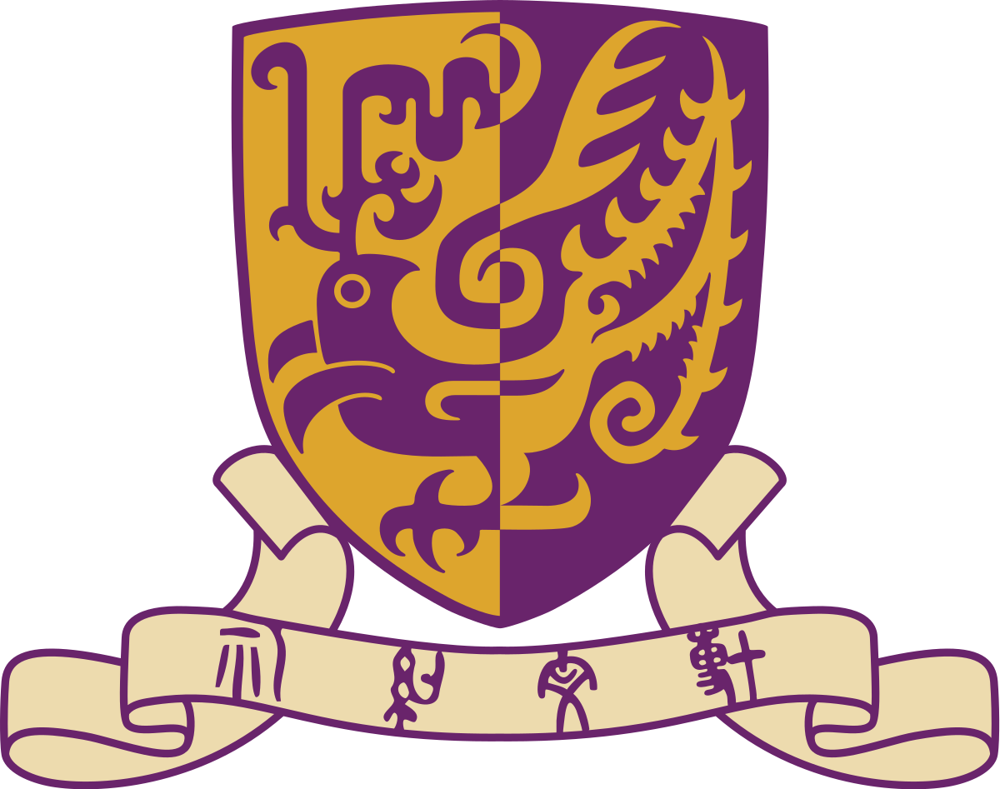

The background workings of the various simple but highly beneficial applications we come across everyday, such as autocorrection, predictive typing, and email spam filtering have always piqued my interest, and this curiosity escalated especially after I began my undergraduate studies in computer engineering. I enjoyed sketching an abstract logical map in my mind about how such applications might possibly function. I was particularly more inclined towards dealing with text since it felt more challenging due to its complex and individualistic nature. The idea of mimicking and emulating human language to build impactful applications compelled me to explore this field further. This drove me towards my internships in the domain of natural language processing, and my experiences motivated me to apply to Graduate school for Computer Science with focus on NLP. 

<!-- [Gradfolio](https://github.com/jitinnair1/gradfolio){:target="_blank"} is a responsive, dark-mode ready Jekyll theme designed keeping academia in mind. The easiest way to install the theme is to fork it using GitHub. Check the README file for [instructions](https://github.com/jitinnair1/gradfolio#installation){:target="_blank"}.

If you want to use this space to write your biography here, edit the `index.md` file. You can put a picture in, too. Rename your picture to `profile.png` and put it in the `assets/images/` folder.

The social-icons footer can be used to link profiles from GitHub, OrcID and ReasearchGate aprart form the usual Twitter, LinkedIn and Facebook. You can add your user ID in the `_config.yml` file to link your accounts. -->

# Experience :

<!-- *   *[sep 2021 - may 2022]*    

 -->
 

 
  
  <b>[2022-Present]</b> Studied the state-of-the-art works related to text generation and text infilling, and explored short stories and multi-turn dialogue datasets to train the models to perform this task. I worked on GPT-2 for performing natural language infilling through the generative objective. I also proposed and implemented a novel approach for masked language modeling and pretraining of ELECTRA for performing sentence infilling through the discriminative objective.</a>

------

 
  
  <b>[Apr 2021 - Sep 2021]</b> Designed the system and functionalities required for efficiently analyzing course feedback from students. I also performed preprocessing of the course feedback, data annotation, descriptive analysis, and implemented various high-level functions namely - clustering and topic modeling, aspect-based sentiment analysis, visualizing the results, and beta version of the front end.

------
<!-- *   
*[Apr 2021 - Sep 2021]* 
 -->

 
  
  <b>[Dec 2019 - Mar 2021]</b> Proposed an efficient graph-based algorithm to perform extractive text summarization, implemented it on a news dataset, and evaluated the performance using the ROUGE metric. I also collected COVID-19 Twitter data along with its geo-location, and implemented the developed algorithm on the tweets to produce topic-wise and location-wise summaries of the data.

  ------

<!--  *[Dec 2019 - Mar 2021]* Studied articles and research papers, collected COVID-19 Twitter data, developed and implemented an efficient graph-based algorithm to produce topic-wise summaries of the tweets using Python, and evaluated performance using the ROUGE metric. -->

 
  
  <b>[May 2019 - July 2019]</b> Mapped unanswerable and follow-up questions of the SQuAD2.0 dataset to the closest answerable questions. I investigated the answerability of an unanswerable question with respect to the mapped answerable question, and proposed a rule-based approach to optimize the answerability score of the question.

------

<!-- *     *[May 2019 - July 2019]*
  * Mapped unanswerable and follow-up questions of the SQuAD2.0 dataset to the closest answerable questions. I investigated the answerability of an unanswerable question with respect to the mapped answerable question, and proposed a rule-based approach to optimize the answerability score of the question. I also explored Word2Vec using the Gensim library on small English and Hindi corpora.
 -->
